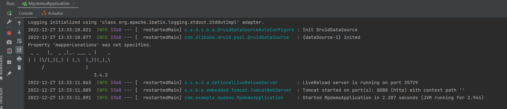
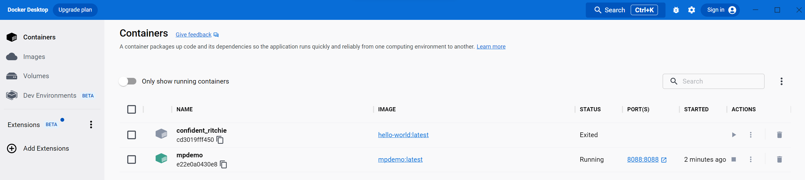
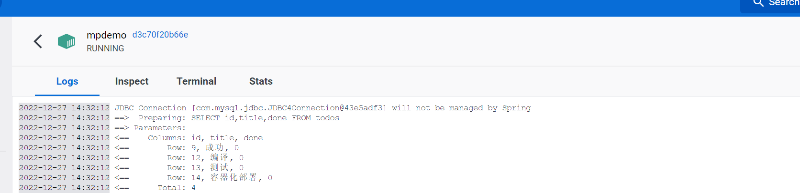

# README

## 概述

- 本项目(Todo App)是软件开发实践课程所发布任务“实现ToolList应用”个人所提交作业，实现了如下基本要求：
  1. 不支持多用户
  2. 数据存放在Mysql数据中
  3. Web页面中可以输入并提交代办事件
  4. Web页面中可以展示所有待办事件列表
  5. 可以将代办事件设置为已完成
- 除此之外，还实现了
  1. 点击"clear all"按钮可以将所有已完成事项清除
  2. 右下角对代办事项(pending tasks)和所有事项(in total)进行了计数
  3. 可一键勾选或取消勾选所有待办事项

## 技术栈

### 前端(front_end)

- Vue2
  - @vue/cli 5.0.8
- node 
  - v18.12.1
- npm  
  - 8.19.2
- 其他具体依赖见./front_end/package.json
- 编译器
  - VS Code

### 后端(back_end)

- Spring Boot
  -  2.7.7
- maven
  - 3.8.6
- Java
  - 1.8.0_351
- 其他具体依赖见./back_end/pom.xml
- 编译器
  - IDEA 2022.3

### 数据库

- MySQL
  - 5.7.38
- 本地数据库可视化工具
  - DBeaver 22.0.4

## 部署

#### 本地部署

##### 前端

```
cd ./front_end
npm install
npm run serve
```

- 以VS Code终端为例运行成功后出现：


- 通过浏览器可查看前端页面(以Edge浏览器为例)


- 数据库中状态为（以DBeaver可视化界面为例）


##### 后端

- 以IDEA为例，编译器将根据pom.xml文件自动为项目导入依赖

- 依赖构建完毕后运行MpdemoApplication启动项目

  

- 运行结果如下

  

- 基本测试(增/改)

  1. 在前端添加待办事项"测试"

     

  2. 页面上显示成功

     

  3. 后端控制台显示

     

  4. 查看数据库(以Dbeaver可视化界面为例)

     

  5. 点击勾选全部事项

     

  6. 再次查看后端

     

  7. 再次查看数据库

     

#### 容器化部署（后端）

##### 概述

- 本项目采取前后端分离的模式，主要对后端采取容器化部署

##### 注意事项

由于本项目开发环境为windows 11, 在集成Docker Desktop和IDEA时，为了解决如下问题：

1. Docker与IDEA的连接问题
2. Docker容器与本地MySQL的连接问题

在开发本地环境做了如下配置上的改动：

1. 允许使用IP访问MySQL

   1. 登入mysql
   2. 使用 `select user,host from user;` 命令查看 **root** 用户的 **host**，可以看到默认是 **localhost**
   3. 修改 **root** 用户的 **host** 为百分号后就可以用 **ip** 访问了
      `update user set host='%' where user='root';`
   4. 然后 `flush privileges;` 使之生效

2. 在后端./back_end/src/main/resources/application.properties中配置连接访问MySQL的访问地址将localhost替换为本机ip(以本机ip:192.168.8.110为例)

   

   

若未做以上配置可能会导致如下报错：

`java.net.ConnectException: Connection refused`

或者

`java.sql.SQLException: null,  message from server: "Host 'host.docker.internal' is not allowed to connect to this MySQL server"`

##### 步骤

1. 编写完DockerFile并借助借助IDEA的maven的package功能完成打包

   

2. 生成mpdemo镜像

   

3. 在IDEA中配置运行时配置

   

4. 运行TodoApp

   

5. 以Docker Desktop为例可以看到正在运行的容器

   

6. 容器成功运行的信息

   

##### 基本测试

- 在本地部署中已经测试了查以及增改功能，此处主要测试容器化部署下的增删的功能

  1. 再次开启前端

     

  2. 增加待办事项容器化部署并勾选

     

  3. 以Docker Desktop为例查看容器日志信息

     

  4. 查看数据库(以Dbeaver可视化界面为例)

     

  5. 删除待办事项“编译”

     

  6. 界面上删除成功

     

  7. 再次查看容器日志信息

     

  8. 再次查看数据库

     

  

### 待完善

1. 每次操作采取的页面刷新会让用户感受到明显的不连续感
2. 某次操作可能出现失灵的情况，需要重复再次操作
3. 后端与前端的交互的代码仍可以优化